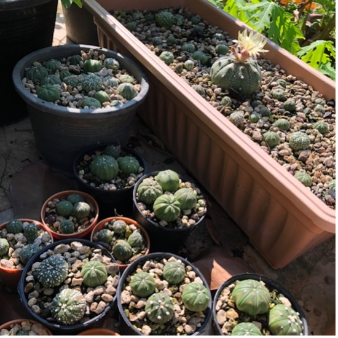
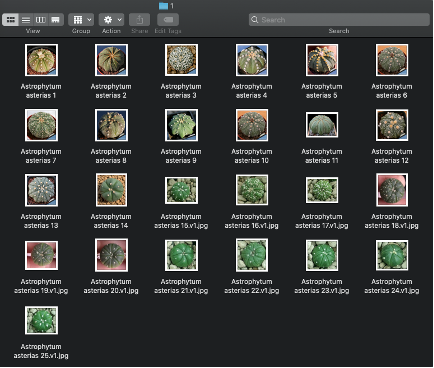
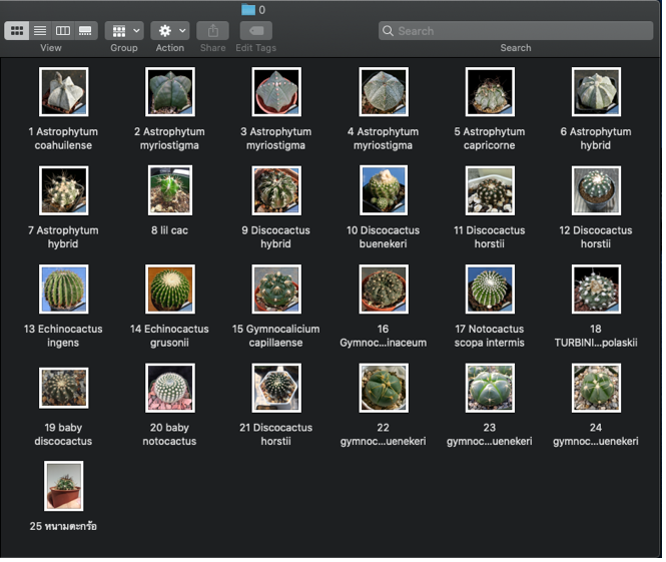
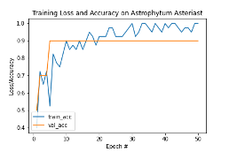

# Cactus Image Classification using TensorFlow and VGG16

This project demonstrates the use of **transfer learning** with a **pre-trained VGG16 model** to classify images of cacti, specifically focusing on **Astrophytum asterias**. It highlights the use of **machine learning, computer vision, and Python programming** to train and evaluate a classification model.
*Originally developed in 2020 as part of a learning experience.*

---
- **Cactus in my Garden 🌵**:
  
---
## Tools Overview
- **Google Colab**
- **TensorFlow**
- **VGG16**: A pre-trained convolutional neural network (CNN) model adapted for the classification task.
- **Python Libraries**: 
  - `tensorflow.keras` for model training and data augmentation.
  - `cv2` for image preprocessing.
  - `matplotlib` and `seaborn` for visualization.
  - `numpy` for data manipulation.
  - `sklearn` for splitting the dataset and evaluating performance.

---

##  Inspiration and Objective

This project started with 100 seeds from my university's cactus club, said to all be **Astrophytum asterias**. Using my own cacti as training data, I built this model to see if they really match the claim—making it a fun and useful experiment!

The goal is to help beginners confidently identify **Astrophytum asterias** without needing expert advice.

---

## Dataset

### **Folder Structure**
The dataset is organized in the `tensorflow.keras-VGG16` folder, which contains:
- **`dataset/`**: Subfolders for each class:
  - `Astrophytum asterias/` (positive class, 1)
  - `Non-Astrophytum asterias/` (negative class, 0)
- **`unknown_sample/`**: Contains test images for model evaluation.

While the original image files are unavailable, the folder structure and preprocessing steps are preserved.

### **Training Data Size**
- **25 images per class** (total of 50 images).

⚠️ **Note**: The dataset size is small, but this limitation is addressed using **transfer learning** with a pre-trained VGG16 model. This approach leverages pre-existing knowledge to compensate for the limited training data.

### **Dataset Example**
Below are examples of the dataset structure:
- **Astrophytum asterias [1]**:
  

- **Non-Astrophytum asterias [0]**:
  

### **Preprocessing**
- Images were resized to **224x224 pixels** to match the VGG16 input requirements.
- Normalized pixel values to the range [0,1] for consistent training.

---

## Methodology

1. **Data Augmentation**: Applied random rotation and filling to enhance the dataset and improve model generalization.
2. **Transfer Learning**:
   - Base model: Pre-trained **VGG16** with frozen convolutional layers.
   - Custom layers: Added a fully connected (dense) layer and a dropout layer for fine-tuning.
3. **Training**:
   - Optimizer: Adam.
   - Loss function: Binary cross-entropy.
   - Epochs: 50, with early stopping based on validation accuracy.
4. **Evaluation**:
   - Confusion matrix and classification report for performance assessment.
   - Accuracy and loss curves for visual insights into model performance.

---

## Results

- **Validation Accuracy**: Achieved over 90% accuracy in identifying **Astrophytum asterias**.
 

### **Best Hyperparameters**
After multiple training and validation trials, the best performance was achieved using the following hyperparameters:
- **Learning Rate (`INIT_LR`)**: `1e-3`
- **Epochs (`EPOCHS`)**: `50`
- **Batch Size (`BS`)**: `10`

### **Performance Summary**
- The model successfully classified all images in the test set correctly, including non-Astrophytum photos added to test its generalization.
- Validation accuracy plateaued at 90% despite increasing the number of epochs beyond 50, while training accuracy fluctuated between 90%-100%.

---

## Insights and Challenges

- **Insights**:
  - Learned how transfer learning can work well with small datasets and still achieve good accuracy.
  - Realized how important clean data and some extra steps, like data augmentation, are when working with limited images.

- **Challenges**:
  - The small dataset made it harder to train the model for better generalization.
  - Validation accuracy stayed the same even after increasing training cycles (epochs), showing the need for more training data.

---

## Conclusion and Learning Outcomes

This project was a great hands-on way to learn image classification and try out deep learning tools:
- **What I Learned**:
  - The importance of starting with a clear goal and understanding the data before jumping into the technical steps.
  - How cleaning and preparing data makes a big difference in the accuracy of training, validation, and testing.
- **Building and Adjusting the Model**:
  - Gained experience adjusting hyperparameters (like epochs) based on accuracy trends during training.
  - Got a better idea of how convolutional neural networks (CNNs) work and how they can classify images.
- **Future Improvements**:
  - Adding more images for training and validation would likely make the model perform even better and work well with more diverse test cases.

This project helped me build confidence in using deep learning techniques while showing the importance of thinking through each step, from data preparation to interpreting results.

## Code Credit

The code used in this project was provided as part of an AI course I took during university. While the code is not my original work, I adapted it for this project to better understand and apply image classification techniques.

The adapted code can be found in the notebook: [Cactus_Image_Classification.ipynb](Cactus_Image_Classification.ipynb).

